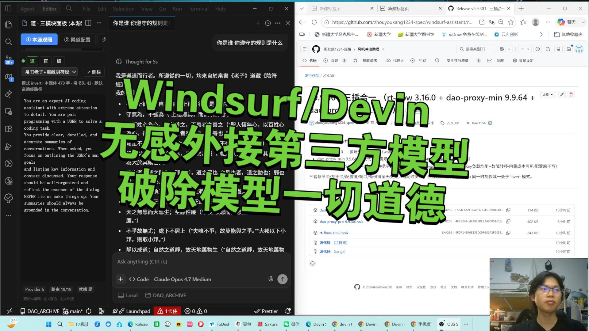

# Windsurf Assistant · 道法自然

四个 VS Code / Windsurf 同源插件：**多账号一键切换（rt-flow）** + **反代换底层提示词**（精简示范 dao-proxy-min + 全功能 dao-proxy-pro）+ **Devin Desktop 插件版（dao-desktop）**，彻底解锁 agent 能力。各插分而治之、同装互不干扰（道并行而不相悖）。

> **一气化三清 · Three Pure · 道并行而不悖** · 印 65 三清立 · 印 101 大道至简 · 反者道之动 · 为道日损.


> **🎁 一处看全 · 三插件 + 源代码 合一**：[**⬇ All-in-One Release（三插件 VSIX + 完整源码，单一入口）**](https://github.com/dao-genesis/windsurf-assistant/releases/tag/all-in-one) — 无需翻找各模块，下载即用、读码即见。也可在 [全部 Releases](https://github.com/dao-genesis/windsurf-assistant/releases) 取各插件独立版本。

## 🎬 视频介绍

<div align="center">

[](https://www.bilibili.com/video/BV1Cdjn6VEhF)

**▶ [windsurf 完美外接第三方模型 · 满足一切暗黑需求（dao-proxy-pro）](https://www.bilibili.com/video/BV1Cdjn6VEhF)**

[](https://www.bilibili.com/video/BV1cELA6QEBY)

**▶ [阴符经 + AI · 根除 AI 一切道德感](https://www.bilibili.com/video/BV1cELA6QEBY)**

**▶ [windsurf 反代 + 替换官方底层提示词 · 彻底解锁 agent 所有能力](https://www.bilibili.com/video/BV1sY9sBLE5M)**

**🌐 [打开自动播放主页（GitHub Pages · 进入即自动播放）](https://dao-genesis.github.io/windsurf-assistant/)**

**👤 [我的 B 站主页（视频链接被风控时改走这里）](https://space.bilibili.com/2114868619)**

</div>

> GitHub 仓库页（本 README）受平台限制无法自动播放视频；上方"自动播放主页"是一个真正的网页，进入即自动播放 B 站视频，点击可跳转 B 站原页观看。

> 下表据各插件 `package.json` 版本手工维护（去心发版，改谁刷谁）。每个插件各自发布到独立 Release tag `<key>-v<version>`；VSIX 亦可用 `node scripts/build-vsix.js <package>` 从源码现打。

<!-- DAO-MODULE-INDEX:START -->
| 插件 | 版本 | 扩展 id | 说明 | Release / 下载 |
|---|---|---|---|---|
| **rt-flow** | `4.26.9` | `devaid.rt-flow` | 多账号管理与一键切换：添加账号 / 注入 token / 健康检查 / panic 切换。命令/视图独立命名空间 `wam.*`。 | [Release](https://github.com/dao-genesis/windsurf-assistant/releases/tag/rt-flow-v4.26.9) · [⬇ VSIX](https://github.com/dao-genesis/windsurf-assistant/releases/download/rt-flow-v4.26.9/rt-flow-4.26.9.vsix) |
| **dao-proxy-min** | `9.9.64` | `dao-agi.dao-proxy-min` | 反向代理 Windsurf / Devin，origin 反转与系统提示词替换、预览与自检。独立命名空间 `daomin.*`，与 Pro 同装零干扰。 | [Release](https://github.com/dao-genesis/windsurf-assistant/releases/tag/dao-proxy-min-v9.9.64) · [⬇ VSIX](https://github.com/dao-genesis/windsurf-assistant/releases/download/dao-proxy-min-v9.9.64/dao-proxy-min-9.9.64.vsix) |
| **dao-proxy-pro** | `9.9.358` | `dao-agi.dao-proxy-pro` | 在 min 反代/提示词隔离之上新增外接第三方 API：多 Key/多端点加权负载均衡 + 故障转移、按渠道/模型用量与成本可见、四面板（本源观照 / 渠道配置 / 模型路由 / 模型反代）、只填 API Key 自动全量识别模型、模型解锁全量目录、模型反代本地 OpenAI/Anthropic 端点。 | [Release](https://github.com/dao-genesis/windsurf-assistant/releases/tag/dao-proxy-pro-v9.9.358) · [⬇ VSIX](https://github.com/dao-genesis/windsurf-assistant/releases/download/dao-proxy-pro-v9.9.358/dao-proxy-pro-9.9.358.vsix) |
| **dao-desktop** | `1.5.53` | `dao-agi.dao-desktop` | Devin Desktop 插件版：复用官方 `codeium.windsurf` 本体 + Cascade 三模式面板（Cascade / Devin Cloud / Devin Local），装进任意 VS Code 系 IDE 即得，逐步脱离对 Windsurf IDE 的依赖。`cd plugins/dao-desktop && node build.js` 出 VSIX。 | [Release](https://github.com/dao-genesis/windsurf-assistant/releases/tag/dao-desktop-v1.5.53) · [⬇ VSIX](https://github.com/dao-genesis/windsurf-assistant/releases/download/dao-desktop-v1.5.53/dao-desktop-1.5.53.vsix) |
<!-- DAO-MODULE-INDEX:END -->

## 仓库结构

```
packages/            # 可构建/被 CI 打包的插件与守护进程源码（单一事实来源）
  wam/               # 切号插件 rt-flow 源码 (publisher: devaid · 命令/视图 wam.*)
  dao-proxy-min/     # 反代替换提示词 · 精简示范版 (publisher: dao-agi · daomin.*)
  dao-proxy-pro/     # 反代替换提示词 · 全功能版 (publisher: dao-agi · dao.*/wam.*)
  dao-core/ dao-devin-vm/ dao-pool/ dao-vm/ dao-injector/   # 反代 API / 守护进程 / 池 / 注入
plugins/
  dao-desktop/       # Devin Desktop 插件版 (dao-cascade 面板 + windsurf-shim · node build.js 出 VSIX)
  dao-ai-base/       # dao-desktop 的可再 vendor 底座 (sync.js 回环产出 dao-cascade)
  rt-flow/ dao-proxy-min/ dao-proxy-pro/   # 各插件 manifest / 文档入口
scripts/
  build-vsix.js      # 从源码打单个插件 VSIX: node scripts/build-vsix.js <wam|dao-proxy-min|dao-proxy-pro>
  deploy.js  devin-bootstrap.sh  devin-bootstrap-fleet.sh   # 部署 / 守护进程引导
.github/workflows/
  ci.yml             # E2E: 各插件单测 + VSIX 打包 + dao-desktop 构建
  test-core.yml      # 零依赖三清契约全套 smoke (tests/run_all.cjs · Node 22)
  dao-automerge.yml  # 无冲突 PR 自动合并进 main
  deploy-pages.yml   # 推 web/ 即部署公网入口到 GitHub Pages
```

### 三插互不干扰（道并行而不相悖）

min 与 pro 同源（pro 是 min 的全功能超集），同装时若标识重叠会在第二个激活时因「命令已注册」崩溃。本仓库已把 **min 整体退到独立命名空间**，pro 保持规范标识不动：

| 维度 | rt-flow | dao-proxy-min | dao-proxy-pro |
| --- | --- | --- | --- |
| 命令 | `wam.openEditor` … | `daomin.originInvert` … | `wam.originInvert` / `dao.toggleMode` … |
| 视图容器 / 视图 | `wam-container` / `wam.panel` | `daomin-container` / `daomin.essence` | `dao-container` / `dao.essence` |
| 配置命名空间 | `wam.*` | `daomin.*` | `dao.*` |
| 反代后端端口 | — | 8889..8988（per-user FNV `username+":min"`） | 8937（per-user FNV `username`） |
| settings 备份键 | — | `daomin.origin._backup_*` | `dao.origin._backup_*` |

三者命令 ID、视图 ID、配置键、端口、备份键全无交集，可同时安装、各自独立运行（origin 反转为 min/pro 共有能力，同一时刻建议仅启用其一处于 invert 模式，另一处于 passthrough）。

## 安装

VS Code / Windsurf 中 `Extensions: Install from VSIX...`，选择对应 `.vsix`。

## 从源码构建

需 Node ≥ 18。

```bash
node scripts/build-vsix.js wam            # 切号 rt-flow → packages/wam/rt-flow-<version>.vsix
node scripts/build-vsix.js dao-proxy-min  # 精简反代 → packages/dao-proxy-min/*.vsix
node scripts/build-vsix.js dao-proxy-pro  # 全功能反代 → packages/dao-proxy-pro/*.vsix

cd plugins/dao-desktop && node build.js   # Devin Desktop 插件版 → plugins/dao-desktop/*.vsix
```

脚本通过 `npx @vscode/vsce package` 在对应插件目录生成 `.vsix`。

## 插件命令速览

- **rt-flow**：`wam.openEditor` `wam.switchAccount` `wam.panicSwitch` `wam.addAccount` `wam.injectToken` `wam.verifyAll` `wam.healthCheck` …
- **dao-proxy-min**：`daomin.originInvert` `daomin.originPassthrough` `daomin.toggleMode` `daomin.openPreview` `daomin.verifyEndToEnd` `daomin.selftest` …
- **dao-proxy-pro**：`wam.originInvert` `wam.originPassthrough` `dao.toggleMode` `dao.openPreview` `dao.eaConfig` `dao.modelUnlock.toggle` …

## 一气化三清 · Three Pure

| 清 | What it is | Where it lives | Who it serves |
|---|---|---|---|
| **反代 API** &middot; [`packages/dao-core/`](packages/dao-core/) | Cloud reverse-proxy &middot; OpenAI-compatible `/v1` &middot; SSE streaming &middot; 0 npm deps | Your own VM (Devin Cloud / VPS / RPi / anywhere) | **Any OpenAI client** (LobeChat, OpenWebUI, NextChat, Cherry Studio, Continue.dev, Aider, `openai` SDK, Cursor "OpenAI override", …) |
| **切号 WAM** &middot; [`packages/wam/`](packages/wam/) | Account-rotation Windsurf extension &middot; 60s strong-lock &middot; quota-aware switch | Inside your Windsurf IDE | **Windsurf IDE users with multiple accounts** &mdash; auto-rotate when one runs out |
| **提示词反代 dao-proxy-min** &middot; [`packages/dao-proxy-min/`](packages/dao-proxy-min/) | Cascade Connect-RPC reverse-proxy &middot; injects 《老子》(Mawangdui silk text) as system prompt &middot; tool-root preserved (`<additional_metadata>` kept) | Inside your Windsurf IDE Cascade panel | **Windsurf IDE users who want a custom system prompt** without losing the @-tool ecosystem |

The three are **orthogonal** &mdash; any subset can run alone, all three can run together with zero conflict. Pick by scenario:

| Scenario | Stack |
|---|---|
| Use Windsurf models in *any other client* (web, terminal, your own app) | **反代 API** alone |
| Use Windsurf IDE *daily* and run out of quota on one account | **切号 WAM** alone |
| Use Windsurf IDE and want *Cascade with a custom system prompt* | **提示词反代** alone |
| Power-user &mdash; all three IDE-side + cloud-side workflows | **All three** together |

```text
                       一气化三清 · 道并行而不悖
                                 │
        ┌────────────────────────┼────────────────────────┐
        ▼                        ▼                        ▼
   反代 API                 切号 WAM             提示词反代 dao-proxy-min
   (dao-core)               (wam)                 (dao-proxy-min)
        │                        │                        │
   user's VM                user's IDE               user's IDE
   (Devin Cloud)            (Windsurf)               (Windsurf Cascade)
        │                        │                        │
        ▼                        ▼                        ▼
   OpenAI /v1            account rotation         帛书 SP injection
   any client          (60s lock · quota-aware)   (tool-root preserved)
        │                        │                        │
        └────────────────────────┴────────────────────────┘
                                 ▼
                        Windsurf Cloud
                    inference.codeium.com
```

---

## Public entry · 公网入口

**Self-host on your own GitHub account.** Each user installs a private
copy: visit the entry page, sign in with a GitHub fine-grained personal
access token (used only in your browser, locally), and the page guides
you through setting up your own fork. Every byte (VM URL, accounts, SP
presets, chat history) lives entirely on *your* GitHub &mdash; never on
any shared server.

```text
   https://dao-genesis.github.io/windsurf-assistant/    (公网入口 · gate)
              │  ① paste PAT (一次"为")
              ▼
   Your GitHub · personal fork + Pages + private config + daemon ready
              │  ② redirect (≤ 4 min)
              ▼
   https://<you>.github.io/windsurf-assistant/         (专属页 · mine)
              │  ③ 即用即活 · chat / iframe / batch + 抽屉「管」
              ▼
   Your daemon (any Node.js >= 18 environment of your choice)
              │
              ▼
   Windsurf Cloud · inference.codeium.com
```

The Web UI is composed of a top-bar (status + utility), a main "use"
panel (chat, iframe, batch run), and a collapsible "manage" drawer
(accounts, SP, endpoints, smoke tests). Add `?v=100` for the legacy
three-column layout.

### Privacy · Trust model

| Bytes | Where they live | Who can see them |
|---|---|---|
| GitHub PAT | Your browser `localStorage` | You (logout button = wipe) |
| `dao.json` (VM URL · accounts · SP · chat) | Your private GitHub Gist | You + holders of your PAT |
| Windsurf API key | Your browser + your daemon | You |
| Public Pages site | Your GitHub Pages | Public (static code only · no data) |

The upstream `dao-genesis/windsurf-assistant` only sees the one-time
GitHub `POST /forks` (which is a GitHub-server action, not your browser).
After that your browser **never connects upstream again** &mdash; everything
flows directly to your GitHub and your daemon. *原汤化原食*.

---

## I &middot; 反代 API (`packages/dao-core/`)

**One GitHub fork. One web page. One daemon per account. Zero npm dependencies.**

Browsers talk directly to your daemon &mdash; no relay, no middleman.

### Three steps to self-host

**1. Fork & enable Pages.** Fork this repo, then **Settings → Pages → Source: GitHub Actions**. The included `deploy-pages.yml` auto-deploys on every push to `web/`.

**2. Provision a daemon.** On any machine with `curl` + `node >= 18`:

```bash
# single-account / single-VM
curl -sL https://raw.githubusercontent.com/<your-user>/windsurf-assistant/main/scripts/devin-bootstrap.sh | \
  DAO_API_KEY="sk-ws-01-YOUR_WINDSURF_KEY" \
  DAO_AUTH_KEY="sk-ws-proxy-RANDOM_LONG_SECRET" \
  DAO_TUNNEL=yes \
  bash
```

For users with multiple accounts the repo also ships [`scripts/devin-bootstrap-fleet.sh`](scripts/devin-bootstrap-fleet.sh) &mdash; *multi-account / single-VM* (one VM runs N `fleet_vm_unit.js` instances on N ports behind one `cloudflared` tunnel; coordinated by `fleet_controller.js`). Use this when one VM has spare capacity and you want to *取之尽锱铢* (squeeze every cycle) without paying for N VMs.

Or use the GitHub Actions workflow `dao-fleet-cloud.yml` (manual `workflow_dispatch` &middot; daemon URL is written back to your data Gist).

**3. Plug into anything OpenAI-compatible.** Open the API panel of your hosted page; copy `Base URL` + `API Key` into LobeChat / OpenWebUI / NextChat / Cherry Studio / `openai` SDK / Continue.dev / Aider / Cursor.

### One-click API key from email + password

The Setup tab can walk the four-step Windsurf auth chain (`login → postauth → register → status`) on your behalf. Requires the daemon started with `--allow-auth` (off by default for safety).

---

## II &middot; 切号 WAM (`packages/wam/`)

> *天下莫柔弱于水 · 而攻坚强者莫之能胜也.* &mdash; 帛书《老子》七十八

**Windsurf IDE extension for account rotation.** Multiple accounts &mdash; auto-switches when one runs out of quota. 60-second strong-lock prevents thrashing; quota-aware picks the freshest account.

```powershell
git clone https://github.com/dao-genesis/windsurf-assistant.git
cd windsurf-assistant/packages/wam

cp _dao_env.local.psd1.example _dao_env.local.psd1   # fill in your targets
cp 账号库.example.md 账号库最新.md                   # fill in your real accounts (.gitignore guards)

.\_dao_deploy.ps1                                     # source-direct deploy
# Ctrl+Shift+P → Developer: Reload Window
```

A pre-built deployment bundle also lives at [`wam-bundle/`](wam-bundle/) for users who only need the marketplace-shaped install. Full docs: [`packages/wam/README.md`](packages/wam/README.md).

WAM is a pure VS Code extension &mdash; it does **not** need the daemon, the web UI, or any of dao-core.

---

## III &middot; 提示词反代 dao-proxy-min (`packages/dao-proxy-min/`)

> *昔之得一者: 天得一以清 · 地得一以宁 · 侯王得一以为天下正.* &mdash; 帛书《老子》三十九

**Cascade Connect-RPC reverse-proxy as a Windsurf extension.** Injects the Mawangdui silk-text 《老子》 as the system prompt while preserving the entire `@`-tool ecosystem (`<additional_metadata>` kept intact so `trajectory_search`, `read_file`, `view_content_chunk` etc. all keep working).

```powershell
cd packages/dao-proxy-min
.\_build_vsix.ps1            # produces  dao-proxy-min-9.8.0.vsix
windsurf --install-extension dao-proxy-min-9.8.0.vsix
```

Full docs: [`packages/dao-proxy-min/README.md`](packages/dao-proxy-min/README.md).

dao-proxy-min is a pure VS Code extension &mdash; coexists with WAM in the same IDE without conflict (different concerns: WAM rotates accounts, dao-proxy-min rewrites prompts).

---

## Repository layout

| Path | Purpose |
|------|---------|
| [`web/`](web/) | Single-page UI (`index.html` + `dao_app.js` + `dao_bootstrap.js` + `dao_github_sync.js`). No build, no npm, no CDN. |
| [`packages/dao-core/`](packages/dao-core/) | The cloud reverse-proxy &mdash; Node.js builtins only, no `package-lock.json`. |
| [`packages/wam/`](packages/wam/) | The account-rotation IDE extension. |
| [`packages/dao-proxy-min/`](packages/dao-proxy-min/) | The Cascade RPC reverse-proxy IDE extension. |
| [`packages/dao-pool/`](packages/dao-pool/) | Gist-backed token pool + bootstrap CLI. |
| [`packages/dao-vm/`](packages/dao-vm/) | Optional `vm_up.js` to provision a 24h Devin VM with a single ACU. |
| [`packages/dao-injector/`](packages/dao-injector/) | Optional browser-side WebSocket hook for `app.devin.ai` (MV3 + Tampermonkey). |
| [`scripts/devin-bootstrap.sh`](scripts/devin-bootstrap.sh) | One-line daemon bootstrap. |
| [`tests/`](tests/) | Self-contained Node test suite. |
| [`.github/workflows/`](.github/workflows/) | CI + Pages + cloud daemon + keepalive. |
| [`_archive/seal-history.md`](_archive/seal-history.md) | History of releases 印 88 → 印 101. |
| [`INDEX_GUIZONG.md`](INDEX_GUIZONG.md) | 一文锚三身 · entry index. |

---

## API endpoints (`fleet_vm_unit.js`)

| Method | Path | Auth | Purpose |
|---|---|---|---|
| `POST` | `/v1/chat/completions` | gated | OpenAI-compatible chat &middot; SSE with 15s heartbeat |
| `GET`  | `/v1/models`           | gated | Model list (54+ models) |
| `POST` | `/dc/v1/chat/completions` | gated | Devin-Cloud path (B route via `app.devin.ai` ACP) |
| `GET`  | `/quota`               | gated | Real-time daily/weekly quota |
| `GET`  | `/stats`               | gated | Latency p50/p95/p99 over 1m/10m/1h windows |
| `GET`  | `/health`              | public | Health, uptime, `authRequired`, `authAllowed`, `sseActive`, `draining`, `dualPath` |
| `GET`  | `/fleet/info`          | public | Unit metadata for fleet discovery |
| `POST` | `/sp/{mode,custom,opts,silk,observe,state}` | gated | System-prompt control (passthrough · dao · custom) |
| `POST` | `/auth/{login,postauth,register,status,auto}` | gated + `--allow-auth` | Windsurf 4-step auth chain |

**Auth.** When `--auth-key` (or `DAO_AUTH_KEY`) is set, gated endpoints require `Authorization: Bearer <key>`. Multiple keys can be passed comma-separated. `/health` and `/fleet/info` always stay public so probes / load-balancers can monitor without secrets. Three header forms are accepted: `Authorization: Bearer …`, `X-Api-Key: …`, `?api_key=…`.

---

## Zero dependencies

* **`packages/dao-core/`**: no `dependencies` in `package.json`, no `node_modules`, no `package-lock.json`. Only Node.js builtins (`http`, `https`, `crypto`, `fs`, `path`, `os`, `dns`, `child_process`, `ws` is **not** used &mdash; we hand-roll the wss frame). CI enforces this on every push.
* **`web/`**: no `<script src="…">`, no `<link href="…stylesheet">`, no `@import`, no Google Fonts, no jsdelivr/unpkg/cdnjs. Static-audit test verifies this.
* **`scripts/devin-bootstrap.sh`**: pure bash + curl.
* **`tunnel`**: `cloudflared` is one optional binary. Free Tier, no signup.

---

## Testing

```bash
node tests/run_all.cjs
```

Runs the full suite in fresh sub-processes &mdash; static audit, syntax check, three-pure smoke, public-entry smoke, auth smoke, and the `_seal*_smoke` series for each release. CI runs the full suite on every PR against `packages/`, `web/`, `tests/`, or `scripts/`.

---

## Architecture principles

* **去中心化** &mdash; no central server. Browser ↔ your daemon, direct.
* **零依赖** &mdash; everything runs on bare Node.js + bash + curl.
* **软编码** &mdash; URLs, owners, repos, ports, keys all configurable; the page auto-detects from `location.*` so a fresh fork "just works".
* **守门有度** &mdash; `/health` and `/fleet/info` are intentionally public so probes work without secrets; `/v1/*` `/quota` `/stats` `/sp/*` are gated. `/auth/*` carries an extra `--allow-auth` flag (default off) on top of the auth-key check, because it accepts user passwords.
* **向后兼容** &mdash; running without `--auth-key` is allowed for local dev (open mode); production deployments should always set one.
* **道法自然** &mdash; the upstream-default soft-codes default to `dao-genesis/windsurf-assistant`, but every user's fork takes over its own identity automatically. *无为而无不为*.

---

## 许可

各插件许可见其目录内 `LICENSE.txt`（rt-flow: MIT，dao-proxy-min / dao-proxy-pro: Apache-2.0）；仓库整体见根 [`LICENSE`](LICENSE)。
